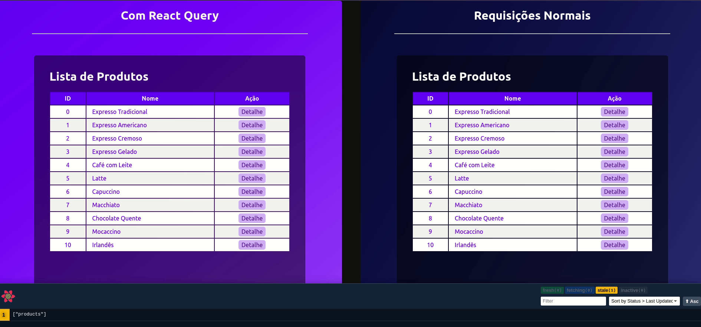

<div align="center" id="top"> 
  

&#xa0;

  <!-- <a href="https://001reactquerycaching.netlify.app">Demo</a> -->
</div>

<h1 align="center">React Query Caching</h1>

<p align="center">
  


</p>

<p align="center">
  <a href="#dart-about">About</a> &#xa0; | &#xa0; 
  <a href="#sparkles-features">Features</a> &#xa0; | &#xa0;
  <a href="#rocket-technologies">Technologies</a> &#xa0; | &#xa0;
  <a href="#white_check_mark-requirements">Requirements</a> &#xa0; | &#xa0;
  <a href="#checkered_flag-starting">Starting</a> &#xa0; | &#xa0;
  <a href="#memo-license">License</a> &#xa0; | &#xa0;
  <a href="https://github.com/wsasouza" target="_blank">Author</a>
</p>

<br>

## :dart: About

Com a tecnologia evoluindo, somos chamados a cada vez mais desenvolver aplicações performáticas, que aproveitem bem os recursos escassos de conectividades de alguns usuários. Portanto a motivação desse projeto é a demonstração de uso e comparação da biblioteca React Query frente aos recursos nativos do React.

## :sparkles: Features

:heavy_check_mark: Listar produtos de uma API;\
:heavy_check_mark: Mostrar detalhe do produto;\
:heavy_check_mark: Comparação do uso do cache em requisições lentas;

## :rocket: Technologies

The following tools were used in this project:

- [React](https://pt-br.reactjs.org/)
- [TypeScript](https://www.typescriptlang.org/)
- [React Query](https://react-query-v3.tanstack.com/)
- [Json Server](https://github.com/typicode/json-server)

## :white_check_mark: Requirements

Before starting :checkered_flag:, you need to have [Git](https://git-scm.com) and [Node](https://nodejs.org/en/) installed.

## :checkered_flag: Starting

```bash
# Clone this project
$ git clone https://react-query-comparison

# Access
$ cd react-query-comparison

# Install dependencies
$ yarn
# or
$ npm install

# Run the server
$ yarn dev:server
# or
$ npm run dev:server

# The server will initialize in the <http://localhost:3333>

# Run the project
$ yarn dev
# or
$ npm run dev

# The server will initialize in the <http://localhost:5173>
```

## :memo: License

This project is under license from MIT. For more details, see the [LICENSE](LICENSE.md) file.

Made with :heart: by <a href="https://github.com/wsasouza" target="_blank">Walter Santos de Andrade Souza</a>

&#xa0;

<a href="#top">Back to top</a>
